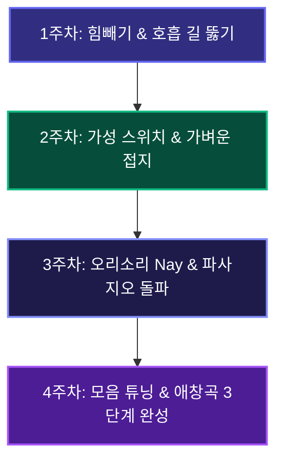

# 🎙️ 비전공자 초보자를 위한 [4주 보컬 마스터 종합 핸드북]
> **유튜브 '노래 쉽게 알려주는 오보컬' 48개 쇼츠 전수 분석 및 현대 음성학(SLS·SOVTE) 완전 집대성**

---

## 🧭 1. 초딩도 1초 만에 이해하는 [실생활 비유 발성 사전]

보컬 트레이닝에서 가장 큰 장벽은 '흉성', '두성', '성대내전', '성구전환' 같은 어려운 용어입니다. 비전공자도 바로 몸으로 느낄 수 있도록 100% 직관적인 실생활 비유로 변환했습니다.

```
┌─────────────────┬───────────────────┬────────────────────────────────────────────────────────┐
│ 어려운 전문 용어│ 초보자용 찰떡 비유 │ 내 몸이 느껴야 하는 실제 감각                          │
├─────────────────┼───────────────────┼────────────────────────────────────────────────────────┤
│ 1. 소리 방향 OUT│ 🎯 물총 쏘기       │ 목으로 삼키지 않고, 앞니 앞 30cm 과녁에 포물선으로 쏘기│
│ 2. 성대 접지    │ 👏 손바닥 포개기   │ 때리지 않고 부드럽게 샥- 스치듯 닫아 흩어지는 공기 모으기│
│ 3. 고음용 호흡  │ 🎈 풍선 주둥이     │ 배를 쥐어짜지 않고 주둥이만 살짝 열어 얇게 공기 보내기 │
│ 4. 후두 안정    │ 🛗 엘리베이터     │ 고음 갈 때 목젖이 턱밑(10층)으로 가지 않고 지하1층 유지│
│ 5. 믹스보이스   │ 🤐 지퍼(Zipper)   │ 아래부터 잠그듯 성대 윗부분만 얇게 남겨서 진동시키기   │
│ 6. 모음 튜닝    │ 🚪 좁은 문 통과   │ 고음 갈 때 입을 크게 벌리지 않고 '아'를 '어'로 살짝 좁히기│
│ 7. 오리 소리    │ 🦆 마녀 웃음(Nay) │ 코맹맹이 소리로 목에 힘을 안 주고도 성대를 얇게 붙이기 │
└─────────────────┴───────────────────┴────────────────────────────────────────────────────────┘
```

---

## 📺 2. '오보컬' 48개 쇼츠 핵심 비법 6대 영역 매핑

| 영역 | 쇼츠 번호 | 오보컬이 밝힌 핵심 솔루션 |
| :--- | :--- | :--- |
| **① 호흡/복압 오해 교정** | 1, 7, 9, 16, 45번 | 배에 무식하게 힘주면 후두가 상승하고 목이 옥죔. 횡격막의 팽창감을 가볍게 유지하는 '패시브 밸런스 압력' 사용 |
| **② 가성 스위치 & 접지** | 2, 5, 11, 14, 35, 37, 39번 | 진성만으로 고음을 밀어붙이지 말고, 가성(CT근)을 먼저 켠 뒤 '응/밍'으로 뜬 소리를 묶어 믹스보이스 생성 |
| **③ 소리 방향성 (OUT)** | 3, 6, 10, 12, 29번 | 소리를 뒤로 삼키면(IN) 목이 조임. 앞니 30cm 앞 허공을 향해 소리의 길을 밖으로(OUT) 열어줄 것 |
| **④ 턱/후두 릴랙스** | 13, 19, 23, 24, 25, 33, 36번 | 턱을 내밀면 목이 막힘. 턱 밑 근육을 풀고 하품하듯 연구개 공간을 확보하여 후두를 안정화 |
| **⑤ 비강공명 vs 생목** | 21, 22, 43, 44번 | 코를 쥐어짜는 맹맹한 소리는 생목. 비강과 구강이 함께 열리는 마스크 공명 통로로 소리를 통과 |
| **⑥ 실전 삑사리/코노 팁** | 4, 15, 18, 32, 40, 47, 48번 | 고음 진입 전 모음을 좁히고(아➔어), 노래방 1분 웜업(립트릴+허밍)으로 음역대 즉각 확장 |

---

## 📅 3. 초보자 4주 단계별 마스터 로드맵



### 🗓️ 1주차 : 목 힘 0% 만들기 & 호흡 길 뚫기
* **핵심 과제:** 소리를 지르지 않고 성대 주변의 긴장을 100% 해소하기.
* **실천 루틴:**
  1. **립트릴(Lip Bubble) 3분:** 입술을 '부르르' 떨며 편안한 저음부터 고음까지 오르내리기.
  2. **빨대 발성(SOVTE) 2분:** 얇은 빨대를 물고 컵의 물을 뽀글거리며 `우-` 소리 내기.
  3. **치찰음 `스-` 훈련 2분:** 윗니 사이로 `스---` 20초간 균일하게 뱉기.

### 🗓️ 2주차 : 가성 스위치 켜기 & 성대 접지 (소리 모으기)
* **핵심 과제:** 흩어지는 뜬 가성에 코 앞쪽 텐션을 더해 알맹이 만들기.
* **실천 루틴:**
  1. **부엉이 소리 `후-` 2분:** 힘을 뺀 상태로 높은 가성 소리 내기.
  2. **비강 자음 붙이기 `응-후 / 밍-` 3분:** 부엉이 소리에 `응`을 붙여 흩어지는 바람을 단단하게 모으기.
  3. **가벼운 어택 `읏-아` 2분:** 성대가 찰칵하고 가볍게 맞닿는 감각 느끼기.

### 🗓️ 3주차 : 믹스보이스 & 파사지오(2옥 솔/라) 돌파
* **핵심 과제:** 2옥타브 파~솔 구간에서 뒤집히지 않고 진성과 가성을 연결하기.
* **실천 루틴:**
  1. **오리 소리 `Nay Nay Nay` 5분:** 과장된 코맹맹이 소리로 5도 상하행 스케일 훈련.
  2. **소리 방향 OUT 던지기 3분:** 앞니 30cm 앞 과녁을 향해 포물선으로 소리 쏘아주기.

### 🗓️ 4주차 : 모음 튜닝 & 실전 애창곡 완성
* **핵심 과제:** 부르고 싶은 노래의 고음 구간을 편안하게 완곡하기.
* **실천 루틴 (3단계 조립법):**
  1. **1단계 (네이 가창):** 목표곡 고음 구간을 가사 대신 `네이 네이`로 부르기 (길 뚫기).
  2. **2단계 (모음 가창):** 자음을 빼고 모음으로만 부르며, '아'는 '어'로 살짝 좁히기 (`사랑해` ➔ `아-아-에`).
  3. **3단계 (가사 얹기):** 열린 길과 모음 모양을 유지한 채 본 가사를 가볍게 얹어 부르기.

---

## ⏱️ 4. 매일 하는 [데일리 15분] 초밀착 실전 워크아웃

| 시간 | 단계명 | 소리/발음 | 초보자 행동 요령 |
| :---: | :--- | :--- | :--- |
| **0 ~ 3분** | **1단계: 웜업** | `부르르- (Lip)` | 턱을 손으로 받치고, 목에 힘을 완전히 뺀 채 사이렌 |
| **3 ~ 6분** | **2단계: 가성 접지** | `응-후 / 밍 (Ming)` | 부엉이 가성에 코 앞쪽 텐션을 붙여 흩어지는 공기 모으기 |
| **6 ~ 10분** | **3단계: 믹스보이스** | `네이 네이 (Nay)` | 마녀/도널드덕 흉내를 내며 2옥타브 파/솔 구간을 부드럽게 통과 |
| **10 ~ 13분** | **4단계: 음압/모음** | `멈 멈 (Mum) / 아➔어` | '멈'으로 후두를 내리고, 높은 음에서 모음을 살짝 좁히기 |
| **13 ~ 15분** | **5단계: 실전 가창** | `네이 ➔ 모음 ➔ 가사` | 애창곡 1소절을 3단계로 나누어 부르고 녹음 모니터링 |

---

## 🆘 5. 자가 진단 & 즉각 응급처방전 (Troubleshooting)

* **🚨 증상 1: 목이 따갑고 기침이 나요**
  * **원인:** 목 안쪽으로 소리를 삼키며 성대를 강하게 쥐어짜는 중 (IN 방향성).
  * **처방:** 즉시 연습 중단 후 미온수를 마시고, 볼에 바람을 넣고 `뿌-` 소리를 내며 성대 쿨다운 1분.
* **⚡ 증상 2: 고음에서 삑사리가 나거나 가성으로 풀려요**
  * **원인:** 성구 전환 구간에서 성대 텐션을 유지하지 못하고 놓침.
  * **처방:** 마녀처럼 콧소리를 섞은 `네이(Nay)` 발음으로 작은 볼륨부터 스케일을 다시 연결.
* **🦟 증상 3: 고음은 나는데 모기 소리처럼 얇아요**
  * **원인:** 가성 근육만 켜지고 성대 접촉 면적이 너무 부족함.
  * **처방:** 입술을 터뜨리는 `멈(Mum)`이나 `밥(Bub)` 발음으로 입술 저항을 주며 가슴 소리 알맹이 보충.
* **🧱 증상 4: 턱에 힘이 꽉 들어가고 턱밑이 굳어요**
  * **원인:** 음정을 올리기 위해 턱밑 근육(이설골근)으로 억지 견인.
  * **처방:** 엄지손가락으로 턱 밑을 누르고 하품하듯 연구개를 열어 `우-` 혹은 `오-` 모음으로 발성.

---

## 💻 6. 인터랙티브 웹 보컬 트레이너 실행 안내

직접 피아노 건반 소리를 들으며 타이머와 함께 훈련할 수 있는 전용 웹 대시보드가 생성되었습니다.

* **로컬 실행 경로:** `C:\Users\vibe\.gemini\antigravity\scratch\vocal_trainer\index.html`
* **주요 내장 기능:**
  - 🎹 **Web Audio 5도/옥타브 자동 발성 스케일러** (남성/여성 키 지원)
  - ⏱️ **15분 데일리 루틴 인터랙티브 타이머 & 비프음 가이드**
  - 🫁 **소리 방향 OUT vs IN 시각화 그래픽 랩**
  - 📅 **4주 마스터 챌린지 데일리 체크리스트 (브라우저 자동 저장)**
